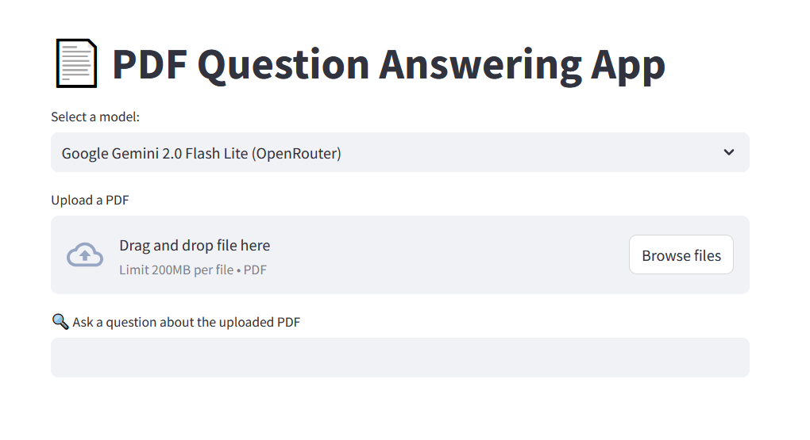

## A simple local RAG chatbot using Deepseek-1:7b to chat with your pdf document

All chatbots (chatGPT, Gemini, Qwen, Deepseek) now support interacting with your pdf documents. However, your pdf documents will be stored and used by their developers. Sometimes, you will need to interact with your pdf files locally to keep them safe. This is the main purpose of this simple RAG chatbot. You can modify code to use other LLM models available from Ollama library. 

Note that pdf processing will take time 

I will spend some time to add options supporting multiple pdf files and online models.

How to use:

####	Create a new conda enviroment and activate it
```
conda create --name pdfchat python=3.11
```
```
conda activate pdfchat
```
#### Clone this deposit
```
git clone <repository-url>
```
#### cd to the repository and Install all requirement 
```
pip install -r requirements.txt 
```
#### Download and install ollama

https://ollama.com/download

#### This RAG chatbot uses deepseek-r1:7b model

```
ollama run deepseek-r1:7b
```

you are free to choo any model that you want and your local machine can afford it.

#### Start Deepseek-r1:7b 

ollama run deepseek-r1:7b

#### Run the application

```
streamlit run pdf_chat.py
```

## A draft of RAG chatbots using free API keys are also available for those who have free API keys store them in a .env file. 

#### .env file looks like this

OPENROUTER_API_KEY_DS_R1=sk-or-v1-xxxxxx

OPENROUTER_API_KEY_DS_R1LLAMA70B=sk-or-v1-xxxxxx

OPENROUTER_API_KEY_GEMINI_PRO_2=sk-or-v1-xxxxxxx

OPENROUTER_API_KEY_GEMINI_FL_2=sk-or-v1-xxxxxxxxxxxxx 

GOOGLE_GEMINI_API_KEY=xxxxxxxxxxxxxx

GROQ_API_KEY=xxxxxxxxxxxxxxxxxxxxxxxx


OPENROUTER_BASE_URL=https://openrouter.ai/api/v1

### Start the chatbot

```
streamlit run pdf_chat_model_api.py
```

