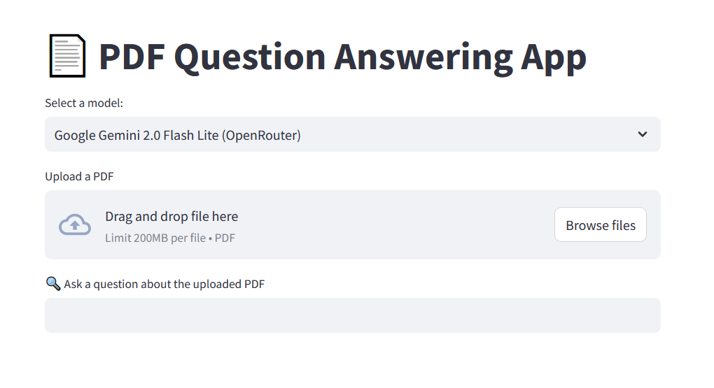

# PDF Chat Using Model API

## Overview
The PDF Chat Model API is a web application that allows users to upload PDF documents and ask questions about their content. The application utilizes various AI models to generate answers based on the information extracted from the uploaded PDFs. Your PDF files are stored offline and totally safe.



## Project Structure
```
pdf-chat-model-api
├── src
│   ├── __init__.py
│   ├── chatpdf.py
│   ├── utils
│   │   ├── __init__.py
│   │   ├── file_processing.py
│   │   ├── logging_config.py
│   │   └── model_selection.py
│   ├── services
│   │   ├── __init__.py
│   │   ├── vector_store.py
│   │   └── answer_generation.py
│   └── config
│       ├── __init__.py
│       └── settings.py
├── .env
├── requirements.txt
├── README.md
└── .gitignore
```

## Installation
1. Clone the repository:
   ```
   git clone <repository-url>
   ```
2. Navigate to the project directory:
   ```
   cd Online-ChatPDF
   ```
3. Install the required dependencies:
   ```
   pip install -r requirements.txt
   ```

## Configuration
- Create a `.env` file in the root directory and add your API keys and other configuration settings as needed. Refer to the `settings.py` file for the required variables.

## Usage
1. Run the application:
   ```
   streamlit run src/chatpdf.py
   ```
2. Open your web browser and go to `http://localhost:8501` to access the application.
3. Upload a PDF document and start asking questions about its content.

## Contributing
Contributions are welcome! Please open an issue or submit a pull request for any improvements or bug fixes.

## License
This project is licensed under the MIT License. See the LICENSE file for more details.